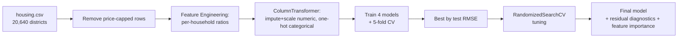

# 🏠 California Housing Price Prediction


Predicts **median house value** for California districts from 1990 census data — the
classic regression benchmark dataset, popularized by *Hands-On Machine Learning*.

---

## 🧠 Why This Project Exists

- **Censored-target handling** — 965 districts have `median_house_value` capped exactly at
  $500,001 (a data-collection ceiling, not a real price). These rows are **removed**, since
  training on them would teach the model a false ceiling that doesn't exist in reality.
- **Ratio features over raw totals** — `total_rooms`, `total_bedrooms`, `population`, and
  `households` are per-*district* totals, which mostly just reflect district size. Converting
  them to per-household ratios (`rooms_per_household`, `bedrooms_per_room`,
  `population_per_household`) isolates housing *quality* signal from population size.
- **4-model comparison with cross-validation** — Linear Regression, Ridge, Random Forest, and
  Gradient Boosting are all evaluated with both a held-out test set and 5-fold CV, so the
  final model choice isn't based on a single lucky split.
- **Full regression diagnostics** — actual-vs-predicted, residuals-vs-predicted, and residual
  distribution plots check the tuned model isn't systematically over/under-predicting at
  either end of the price range.

---

## 🚀 Quickstart (60 Seconds)

```bash
git clone <repo-url>
cd california-housing-price-prediction
pip install -r requirements.txt
jupyter notebook california_housing_price_prediction.ipynb
```

> The notebook reads `data/housing.csv` directly — no separate download needed.

---

## 🏗️ Architecture / Under the Hood

**Tech stack:** `pandas` · `scikit-learn` · `matplotlib` / `seaborn`



**Pipeline flow:**
1. Load 20,640 California districts, 9 numeric features + 1 categorical (`ocean_proximity`).
2. EDA: target distribution, all numeric feature histograms, correlation heatmap, price by
   ocean proximity, and a geographic scatter (longitude/latitude, colored by price, sized by
   population).
3. Remove 965 rows where `median_house_value` is capped at $500,001 (censored, not real).
4. Engineer `rooms_per_household`, `bedrooms_per_room`, `population_per_household`; drop the
   raw totals they replace (`total_rooms`, `total_bedrooms`, `population`, `households`).
5. Preprocess: median-impute + scale numeric features, one-hot encode `ocean_proximity`.
6. 80/20 train/test split (15,740 / 3,935 rows); train and 5-fold cross-validate 4 regressors.
7. Tune the selected model via 40-iteration `RandomizedSearchCV` (5-fold CV, scored on RMSE).
8. Final evaluation: actual-vs-predicted plot, residual diagnostics, feature importances.

---

## 📊 Data & Model Details

**Dataset:** [California Housing (1990 census)](https://www.kaggle.com/datasets/camnugent/california-housing-prices)
— 20,640 districts, 10 raw columns (location, housing age, room/bedroom/population/household
totals, median income, `ocean_proximity`, target). `total_bedrooms` has 207 missing values
(median-imputed). 19,675 rows remain after removing price-capped districts.

**Target:** `median_house_value` (continuous, $14,999–$500,000 after capping removal).

**Model comparison (test set):**

| Model | MAE | RMSE | R² | CV RMSE (5-fold) |
|---|---|---|---|---|
| Linear Regression | $47,286 | $63,663 | 0.5935 | $62,225 ± $975 |
| Ridge Regression | $47,275 | $63,645 | 0.5937 | $62,264 ± $940 |
| **Random Forest** | **$30,465** | **$45,909** | **0.7886** | **$45,049 ± $466** |
| Gradient Boosting | $32,627 | $46,894 | 0.7795 | $45,718 ± $634 |

> **Why Gradient Boosting was chosen for tuning, not Random Forest:** at baseline, the two
> models are statistically indistinguishable — Random Forest's test RMSE ($45,909) and
> Gradient Boosting's ($46,894) differ by less than 2%, and their 5-fold CV ranges actually
> overlap (RF: $45,049 ± $466 → $44,583–$45,515; GB: $45,718 ± $634 → $45,084–$46,352). At
> that margin, picking the "better" baseline is closer to noise than signal. The deciding
> factor is **tuning headroom**: Random Forest's trees are built independently and averaged
> (bagging), so each tree can't learn from the last one's mistakes — depth and leaf-size
> hyperparameters mostly trade bias for variance rather than unlocking new accuracy. Gradient
> Boosting builds trees **sequentially**, each one explicitly correcting the previous
> ensemble's residual errors, so its hyperparameters (`learning_rate`, `subsample`,
> `max_features`, tree depth) control *how* that error-correction happens — which tends to
> leave more performance on the table for a search to find. That bet paid off here: tuned
> Gradient Boosting reached **$42,113 RMSE**, beating not just its own baseline but also
> Random Forest's untuned $45,909 by a clear ~8% margin.

**Tuned Gradient Boosting** (`RandomizedSearchCV`, 40 iterations, 5-fold CV, best CV RMSE =
$41,654): `n_estimators=400`, `learning_rate=0.1`, `max_depth=6`, `min_samples_split=2`,
`subsample=0.9`, `max_features='log2'`.

| Metric | Untuned Gradient Boosting | Tuned Gradient Boosting |
|---|---|---|
| MAE | $32,627 | **$28,069** |
| RMSE | $46,894 | **$42,113** |
| R² | 0.7795 | **0.8221** |

### 🧩 Intuition: what does an R² of 0.82 and MAE of $28K actually mean?
Picture 100 California districts lined up by home price. R² of 0.82 means the model accounts
for 82% of *why* those prices differ from each other — location, income, and housing density
explain most of the variation, with 18% left to factors not in this dataset (school quality,
crime rates, specific street-level desirability, etc.). MAE of $28,069 means: on a district
worth $300,000, expect the model's guess to typically land somewhere between about $272K and
$328K — useful for a rough district-level valuation tool, not precise enough for pricing an
individual house.

**Top 5 features** (by importance): `median_income` (by far the strongest — wealthier
districts have pricier homes), `ocean_proximity_INLAND` (being inland strongly *lowers*
price — coastal proximity is a major price driver in California), `latitude`, `population_per_household`, `longitude` — location and income dominate over housing-structure features.

---

## 📁 Repository Structure

```
california-housing-price-prediction/
├── data/
│   └── housing.csv                          # 20,640 California districts, 1990 census
├── california_housing_price_prediction.ipynb # full pipeline: EDA → cleaning → FE → modeling → tuning
├── requirements.txt
└── README.md
```

---

## 🤝 Contribution & License

Issues and PRs are welcome — natural extensions include re-tuning Random Forest for a fair
head-to-head against the tuned Gradient Boosting, adding a `distance_to_coast` continuous
feature instead of the categorical `ocean_proximity`, or log-transforming the right-skewed
target before modeling.

Licensed under the **MIT License**.
